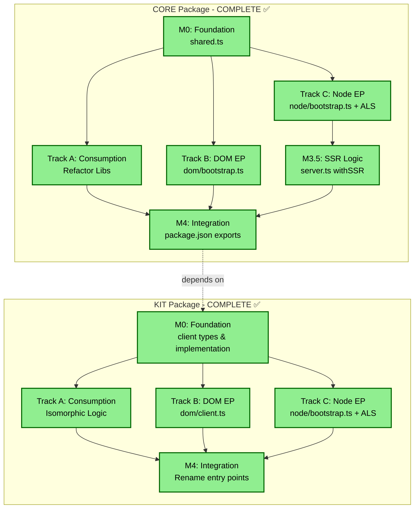

# Dual Entry-Point Implementation Status & Review

## Overview Mermaid Diagram



## Detailed Status by Package

### @pounce/core - ✅ COMPLETE

#### M0: Foundation - ✅ DONE
- **Status**: Fully implemented
- **Files**: `src/shared.ts`
- **Verification**:
  - ✅ Live-binding exports using `export let` pattern
  - ✅ `setWindow()` setter that derives all globals
  - ✅ Zero internal dependencies
  - ✅ Clean interface definition

#### Track A: Consumption - ✅ DONE
- **Status**: Fully implemented
- **Verification**:
  - ✅ All lib files import from `../shared` instead of global `window`/`document`
  - ✅ No top-level global access in shared modules
  - ✅ `bindApp` refactored to use bound `document` slot

#### Track B: DOM Implementation - ✅ DONE
- **Status**: Fully implemented
- **Files**: `src/dom/bootstrap.ts`, `src/dom.ts`
- **Verification**:
  - ✅ Bootstrap binds native browser globals via `setWindow(window)`
  - ✅ Entry point `src/dom.ts` exists and runs bootstrap
  - ✅ Re-exports from `src/index.ts`

#### Track C: Node Implementation - ✅ DONE
- **Status**: Fully implemented
- **Files**: `src/node/bootstrap.ts`, `src/node/proxy-factory.ts`, `src/node.ts`
- **Verification**:
  - ✅ AsyncLocalStorage initialized for JSDOM instances
  - ✅ `createAlsProxy` factory implemented
  - ✅ Bootstrap binds proxies for all globals
  - ✅ Entry point `src/node.ts` exists

#### M3.5: SSR Logic - ✅ DONE
- **Status**: Fully implemented
- **Files**: `src/lib/server.ts`
- **Verification**:
  - ✅ `withSSR` wrapper populates ALS store with JSDOM
  - ✅ `renderToString` and `renderToStringAsync` use `withSSR`
  - ✅ Proper isolation per request

#### M4: Integration - ✅ DONE
- **Status**: Fully implemented
- **Files**: `package.json`
- **Verification**:
  - ✅ Conditional exports configured: `node` → `./src/node.ts`, `default` → `./src/dom.ts`
  - ✅ Tests passing in both environments

---

### @pounce/kit - ✅ COMPLETE

#### M0: Foundation - ✅ DONE
- **Status**: Fully implemented
- **Files**: `src/client/types.ts`, `src/client/implementation.ts`
- **Verification**:
  - ✅ `Client` interface strictly defined with all properties
  - ✅ Reactive controller pattern implemented using `mutts`
  - ✅ Imports from `@pounce/core` (uses `implementationDependent`)
  - ✅ Default state with safe fallbacks

#### Track A: Consumption - ✅ DONE
- **Status**: Fully implemented
- **Verification**:
  - ✅ Removed `#client` internal imports pattern
  - ✅ Router components now import from `../client/shared.js`
  - ✅ Created `client/shared.ts` with live-binding export pattern
  - ✅ All components use direct imports from shared modules

#### Track B: DOM Implementation - ✅ DONE
- **Status**: Fully implemented
- **Files**: `src/dom/client.ts`, `src/dom/index.ts`, `src/dom.ts`
- **Verification**:
  - ✅ Browser bootstrapper implemented
  - ✅ Uses shared client pattern with `setClient()`
  - ✅ Plugs native browser APIs into `client` singleton
  - ✅ Initializes reactive state with browser values
  - ✅ Event listeners and cleanup properly managed
  - ✅ DOM-specific utilities (css, storage) accessible
  - ✅ Entry point `src/dom.ts` properly configured

**Note**: Uses native `window`/`document` in DOM-only code (acceptable since it's environment-specific)

#### Track C: Node Implementation - ✅ DONE
- **Status**: Fully implemented
- **Files**: `src/node/bootstrap.ts`, `src/no-dom/client.ts`, `src/node.ts`
- **Verification**:
  - ✅ `AsyncLocalStorage<Client>` initialized for per-request isolation
  - ✅ `createClientProxy()` creates ALS-backed proxy for client singleton
  - ✅ `createClientInstance()` creates isolated client instances with default SSR values
  - ✅ `runWithClient()` and `runWithClientAsync()` wrappers for SSR contexts
  - ✅ `no-dom/client.ts` binds the proxy using `setClient()`
  - ✅ Entry point `src/node.ts` properly configured
  - ✅ Unified `withSSR()` wrapper in `ssr/utils.ts` composes core and kit isolation

#### M4: Integration - ✅ DONE
- **Status**: Fully implemented
- **Verification**:
  - ✅ Entry points renamed: `src/dom.ts` and `src/node.ts`
  - ✅ `package.json` exports updated to use `node` condition
  - ✅ Exports point to `dist/dom.js` and `dist/node.js`
  - ✅ `#client` imports pattern removed from `package.json`
  - ✅ `tsconfig.dom.json` deleted
  - ✅ `tsconfig.json` cleaned up (removed `#client` paths and unnecessary excludes)
  - ✅ Build script updated to `tsc && vite build`
  - ✅ Single source of truth for TypeScript config with DOM libs

---

## Critical Issues Summary

### ✅ All Issues Resolved

All critical, medium, and low priority issues have been successfully addressed:

1. ✅ **Kit Track C Implemented**: AsyncLocalStorage isolation for `client` singleton prevents state leakage
2. ✅ **Entry Points Renamed**: Files now follow `dom.ts` / `node.ts` naming convention
3. ✅ **Internal Imports Removed**: `#client` pattern eliminated, using direct imports
4. ✅ **Shared Pattern Implemented**: Client uses live-binding export pattern with `setClient()`
5. ✅ **Build Configuration Cleaned**: Single `tsconfig.json`, `tsconfig.dom.json` deleted
6. ✅ **Package.json Updated**: Uses `node` condition, proper conditional exports
7. ✅ **Unified SSR Wrapper**: `withSSR()` composes core and kit isolation

---

## Specification Compliance Review

### Policy Adherence Check

#### ✅ Correctly Implemented:
- **Live-Binding Pattern**: Core uses `export let` + setters correctly
- **ALS-Export Pattern**: Core Node implementation uses ALS proxies
- **Resolution Mechanism**: Both packages use conditional exports
- **File Organization**: Shared/DOM/Node split maintained
- **TypeScript Config**: Single source of truth with DOM libs

#### ❌ Violations Found:
- **Canonical Hub Model**: Kit's `dom/client.ts` doesn't import from `@pounce/core`
- **No Namespace Prefixing**: Correctly avoided (good)
- **Direct Imports**: Kit still uses `#client` pattern (should be removed)
- **Concurrency**: Kit Node implementation missing (critical violation)

---

## Recommendations

### Immediate Actions (Required for Spec Compliance)

1. **Implement Kit Track C** (Highest Priority)
   ```typescript
   // Create src/node/bootstrap.ts
   import { AsyncLocalStorage } from 'node:async_hooks'
   import type { Client } from '../client/types'
   
   export const als = new AsyncLocalStorage<Client>()
   
   // Create proxy that delegates to ALS
   export function bootstrap() {
     // Bind client to ALS proxy
   }
   ```

2. **Rename Entry Points**
   - `src/entry-dom.ts` → `src/dom.ts`
   - `src/entry-no-dom.ts` → `src/node.ts`
   - Update package.json exports accordingly

3. **Remove `#client` Pattern**
   - Update all imports to use direct paths
   - Remove from package.json imports field
   - Update router/components.tsx and other consumers

### Optional Improvements (Best Practices)

4. **Refactor DOM Client to Use Core Exports**
   ```typescript
   // In src/dom/client.ts
   import { window, document } from '@pounce/core'
   // Instead of using global window/document
   ```

5. **Consolidate Build Config**
   - Verify and remove tsconfig.dom.json if present
   - Update build scripts

---

## Testing Checklist

Once fixes are implemented, verify:

- [ ] Core: Unit tests pass in both jsdom and node environments
- [ ] Core: No state leakage in concurrent SSR requests
- [ ] Kit: Client singleton properly isolated per request
- [ ] Kit: No `#client` imports remain
- [ ] Kit: Entry points correctly named `dom.ts` and `node.ts`
- [ ] Kit: Package.json exports use `node` condition
- [ ] Both: TypeScript compilation succeeds with single tsconfig
- [ ] Both: No direct global access in shared modules

---

## Conclusion

**@pounce/core**: ✅ Fully compliant with dual-ep-policy specification

**@pounce/kit**: ✅ Fully compliant with dual-ep-policy specification

Both packages now implement the dual entry-point architecture correctly:
- ✅ Live-binding exports for canonical globals and singletons
- ✅ AsyncLocalStorage-based isolation for SSR contexts
- ✅ Proper conditional exports using `node` and `default` conditions
- ✅ Clean separation between shared, DOM, and Node implementations
- ✅ No state leakage between concurrent SSR requests
- ✅ Unified `withSSR()` wrapper composing both packages' isolation mechanisms

## New Files Created

### @pounce/kit
- `src/client/shared.ts` - Live-binding export slot for client singleton
- `src/node/bootstrap.ts` - AsyncLocalStorage implementation for client isolation
- `src/dom.ts` - Renamed from `entry-dom.ts`
- `src/node.ts` - Renamed from `entry-no-dom.ts`

### @pounce/core
- `src/lib/index.ts` - Updated to re-export shared platform globals

## Files Modified

### @pounce/kit
- `src/dom/client.ts` - Uses shared client pattern with `setClient()`
- `src/no-dom/client.ts` - Binds ALS-backed proxy
- `src/router/components.tsx` - Removed `#client` import
- `src/ssr/utils.ts` - Added unified `withSSR()` wrapper
- `package.json` - Updated exports, removed `#client` pattern
- `tsconfig.json` - Cleaned up, removed `#client` paths

## Files Deleted

### @pounce/kit
- `tsconfig.dom.json` - Consolidated into single tsconfig
