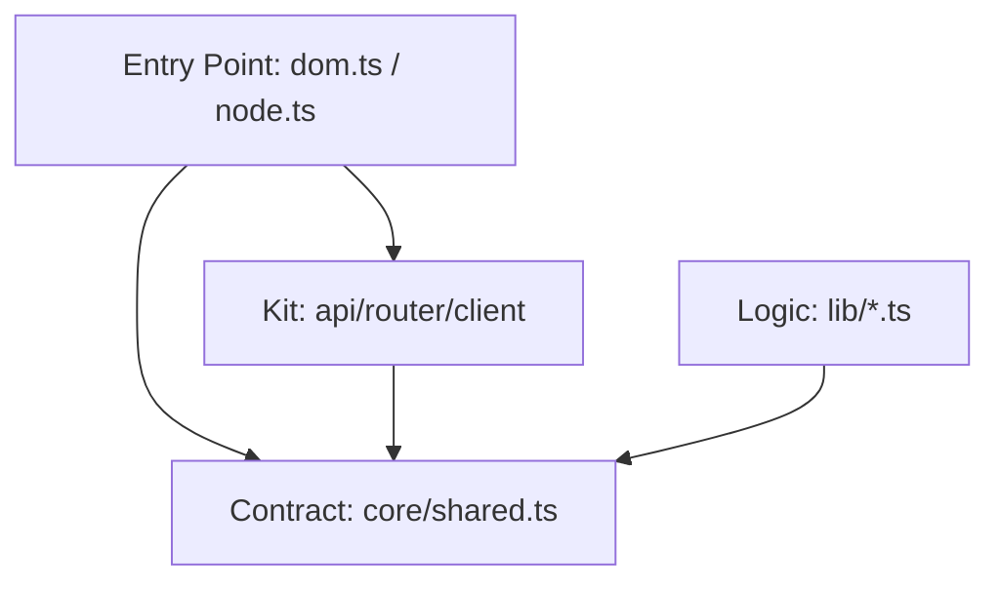

# Isomorphic Dual Entry-Point System

This project uses a dual entry-point architecture to provide environment-optimized implementations (DOM vs. Node.js) while maintaining a shared codebase.

## 1. Resolution Mechanism

Environment selection is handled **statically** at resolution time (by the bundler or runtime) using `package.json` **Conditional Exports**.

### Automatic Selection
When importing from the base package (`import { ... } from 'the-library'`), the environment is selected automatically:
- **`node` condition**: Resolves to the Node.js implementation.
- **`default` condition**: Resolves to the Browser/DOM implementation.

---

## 2. File Organization

The codebase is split into three layers:

1.  **Shared Core (`src/*.ts`)**: Isomorphic code that contains the library logic. It must **never** reference `dom` or `node` directories directly.
2.  **DOM Implementation (`src/dom.ts`)**: Browser-specific bootstrap.
3.  **Node Implementation (`src/node.ts`)**: Server-specific bootstrap.
    - *Request Isolation*: Node entry points must ensure thread-safety for concurrent SSR requests using **AsyncLocalStorage**.

---

## 3. Ecosystem Stewardship: The Canonical Hub

To prevent implementation fragmentation, the project follows a "Single Hub" model:

1.  **@pounce/core as Authority**: This package defines the **canonical environment contract**. It exports the full suite of DOM globals (`document`, `window`, etc.) as **Live-Binding Exports**.
2.  **@pounce/kit as the Reactive Suite**: Provides higher-level isomorphic utilities:
    - **`client`**: The reactive interface to the platform (e.g., `client.url`, `client.prefersDark`). Changing `client.url` on the server triggers a 304 redirect.
    - **`api` & `router`**: Primary functional exports.
3.  **Cross-Project Binding**: When an application resolves an entry point, it "enlightens" the canonical exports in `@pounce/core`. Because these exports are singletons in the dependency graph, all other packages (`kit`, `board`) automatically inherit the correct environment implementation.

---

## 4. Implementation Patterns

To satisfy "Short and Elegant" API requirements, we avoid namespace prefixing in favor of direct, dynamic exports.

### A. Live-Binding Pattern (The Foundation)
Used for both globals (`document`) and functions (`api`). 
1.  **Shared Core (`src/shared.ts`)**: Defines the export slot with `export let` and a setter.
2.  **Entry Point (`dom.ts` / `node.ts`)**: Binds the actual implementation using the setter.

### B. ALS-Export Pattern (Server-Side Globals)
In the Node.js entry point, globals like `document` are bound to a **Context Proxy**. This proxy resolves to the correct request-specific object via `AsyncLocalStorage`.
- **Reference**: See detailed analysis in [als-export.md](./packages/core/analysis/als-export.md).

### C. Reactive Controllers (Application State)
Used for the `client` object in `@pounce/kit`. It is a singleton instance whose properties/methods are reactive. It internally consumes the bound `document` from `@pounce/core`.

---

## 5. TypeScript Configuration

The project uses a single source of truth for types:
- **Root `tsconfig.json`**: Configured with `lib: ["DOM", "DOM.Iterable", "ESNext"]`.
- Since Node uses JSDOM, both environments are "DOM-compliant" at a type level, avoiding casts in Shared Core.

---

## 6. Dependency Flow & Architecture (The Hub Model)

1.  **Bootstrapping**: The **Entry Point** runs first.
2.  **Binding**: The Entry Point calls setters (e.g., `setApi`, `setDocument`) in `core/shared`.
3.  **Usage**: Logic imports `document` or `api` directly. The live-bindings automatically point to the bound implementation.

---

## 7. Final "Don't Forget" Checklist

- [ ] **Direct Imports**: Use `import { document } from '@pounce/core'`.
- [ ] **No Namespace Prefixing**: Do not use `platform.` or `host.` prefixes for canonical globals.
- [ ] **ESM Mutation Rule**: You **cannot** reassign an imported variable. You **must** call the provided setter in the Entry Point.
- [ ] **Concurrency**: Always ensure the server implementation isolates requests via `AsyncLocalStorage`.