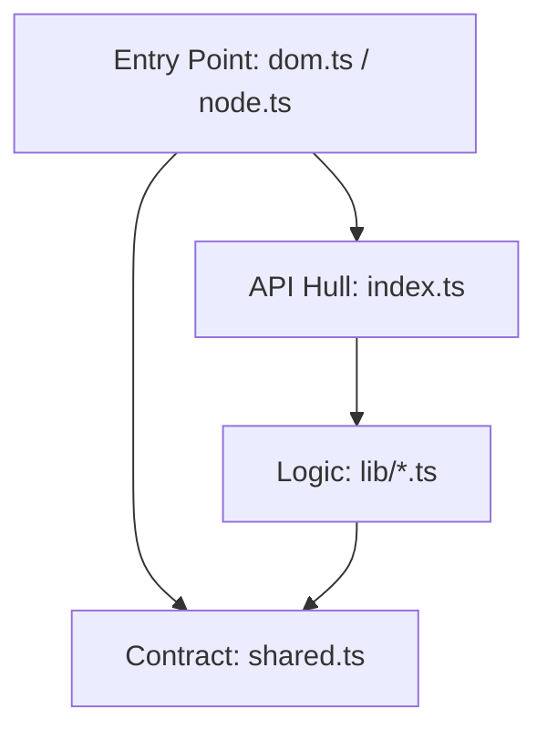

# Isomorphic Dual Entry-Point System

This project uses a dual entry-point architecture to provide environment-optimized implementations (DOM vs. Node.js) while maintaining a shared codebase.

## 1. Resolution Mechanism

Environment selection is handled **statically** at resolution time (by the bundler or runtime) using `package.json` **Conditional Exports**.

### Automatic Selection
When importing from the base package (`import { ... } from 'the-library'`), the environment is selected automatically:
- **`node` condition**: Resolves to the Node.js implementation.
- **`default` condition**: Resolves to the Browser/DOM implementation.

### Explicit Selection
To bypass automatic detection or for testing specific environments, use sub-paths:
- `the-library/dom`: Forces Browser implementation.
- `the-library/node`: Forces Node.js implementation.
- `the-library/src/dom` / `the-library/src/node`: Points directly to source files (useful for monorepo development).

---

## 2. File Organization

The codebase is split into three layers:

1.  **Shared Core (`src/*.ts`)**: Isomorphic code that contains the library logic. It must **never** reference `dom` or `node` directories directly.
2.  **DOM Implementation (`src/dom.ts` or `src/dom/index.ts`)**: Browser-specific code utilizing `window`, `document`, etc.
3.  **Node Implementation (`src/node.ts` or `src/node/index.ts`)**: Server-specific code. It uses **JSDOM** to provide a virtual DOM environment.
    - *Constraint*: JSDOM should only be initialized and accessed within this layer or the tests.
    - *Request Isolation*: In complex server environments (like SSR), the Node EP should bind the `platform` to an **`AsyncLocalStorage`** store. This allows multiple concurrent requests to have their own isolated `window` and `document` without global state contamination.
    - *Platform Provider*: For standard DOM operations, `@pounce/core` acts as the canonical provider. Other libraries in the ecosystem should utilize the platform definitions from `pounce/core` rather than re-implementing them, provided the dependency direction allows it.

---

## 3. TypeScript Configuration

To stay "short and elegant," the project uses a single source of truth for types:

- **Root `tsconfig.json`**: Configured with `lib: ["DOM", "DOM.Iterable", "ESNext"]`. 
  - Since the Node environment utilizes JSDOM, both environments are "DOM-compliant" at a type level.
  - This avoids casting when the Shared Core needs to manipulate `Element`, `Node`, or `DocumentFragment`.

- **Architectural Guardrail**: 
  - While **types** (e.g., `: HTMLElement`) are always safe to use in Shared Core, **globals** (e.g., `document.body`) should be accessed **lazily** (inside functions) or via the `platform` object. 
  - This prevents the Shared Core from crashing if it is imported before the Node EP has finished initializing the JSDOM environment.

---

## 3. Implementation Pattern: "Late-Binding Implementation"

This library uses a **late-binding/mutation** pattern to fill in environment-dependent gaps.

### The Problem
Shared logic depends on environment-specific functions (e.g., `scheduleUpdate`), but the shared code cannot know the implementation.

### The Solution (Required)
1.  **Declaration**: The Shared Core defines and exports a **mutable object or class**.
2.  **Stubbing**: In the shared entry point, the properties/methods are initialized as "incomplete" (e.g., throwing `implementationDependent`).
3.  **Binding**: Each Environment EP (`/dom` or `/node`) imports the shared object and **mutates its properties** with the specific implementation. 

> **Important**: ESM imports are read-only bindings. You cannot reassign an imported variable (`X = newImpl`), but you can modify its properties (`X.impl = newImpl`).

**Example Flow:**
1. `shared.ts` (The Contract) defines the platform interface: 
   ```typescript
   /** Stub for implementation-dependent features */
   export function implementationDependent(feature: string): any {
     return () => { throw new Error(`Not Implemented: ${feature}`) };
   }

   /** The global (but mutable) platform contract */
   export const platform = {
     createElement: implementationDependent('createElement'),
     createTextNode: implementationDependent('createTextNode'),
   };
   ```
2. `dom.ts` imports the object and provides the native implementation:
   ```typescript
   import { platform } from './shared';
   
   platform.createElement = (tag) => document.createElement(tag);
   platform.createTextNode = (text) => document.createTextNode(text);
   ```
3. `node.ts` (using JSDOM) provides its own:
   ```typescript
   import { platform } from './shared';
   import { JSDOM } from 'jsdom';
   
   const doc = new JSDOM().window.document;
   platform.createElement = (tag) => doc.createElement(tag);
   ```

## 5. Dependency Flow & Architecture

To satisfy both **Isomorphism** and **Type-Safety**, the library follows a strict 4-layer dependency hierarchy. 

### The Components
- **`shared.ts` (The Contract)**: Contains the "Abstract" definitions (the `platform` object, stubs). It is the base dependency and must have **zero** internal library dependencies.
- **Internal Logic (`src/lib/*.ts`)**: Implementation of library features. These files import `platform` from `shared.ts` to perform environment-dependent tasks.
- **`src/index.ts` (The API Hull)**: Aggregates and re-exports all internal logic. This is what the user *expects* the library to be.
- **Entry Points (`dom.ts` / `node.ts`)**: The bootstrappers. They import `shared.ts` to bind implementations and re-export `src/index.ts` to expose the API.

### Visualized Flow (Non-Circular)



1.  **Bootstrapping**: When the consumer imports the library, the **Entry Point** runs first.
2.  **Binding**: The Entry Point immediately "plugs" the implementation into `shared.ts`.
3.  **Consumption**: When the **Logic** runs (triggered by the user via the **API Hull**), it accesses the now-bound `platform` in `shared.ts`.

---

## 6. Final "Don't Forget" Checklist

- [ ] **No Globals**: Use `import/export`. Do not rely on `globalThis` or magic globals for state sharing.
- [ ] **ESM Mutation Rule**: You **cannot** reassign an imported variable. You **can** mutate properties of an imported object (e.g., `platform.createElement = ...`).
- [ ] **The `shared.ts` Purity**: `shared.ts` should never import from `lib/` or `index.ts`. It is the "foundation" and must remain at the bottom of the dependency tree.
- [ ] **Top-Level Isolation**: Shared files must be safe to import in *any* environment. Never call a platform-dependent method at the top level of a file.
- [ ] **Circular Safety**: Always ensure the direction is `Side -> Center (Shared)`.
- [ ] **Vitest Guard**: When writing tests, ensure you are testing the correct entry point by using the appropriate vitest environment (`jsdom` vs `node`).
- [ ] **Short & Elegant**: Keep implementations as concise as possible. Use standard DOM APIs where possible (via JSDOM in Node), but always routed through `platform`.