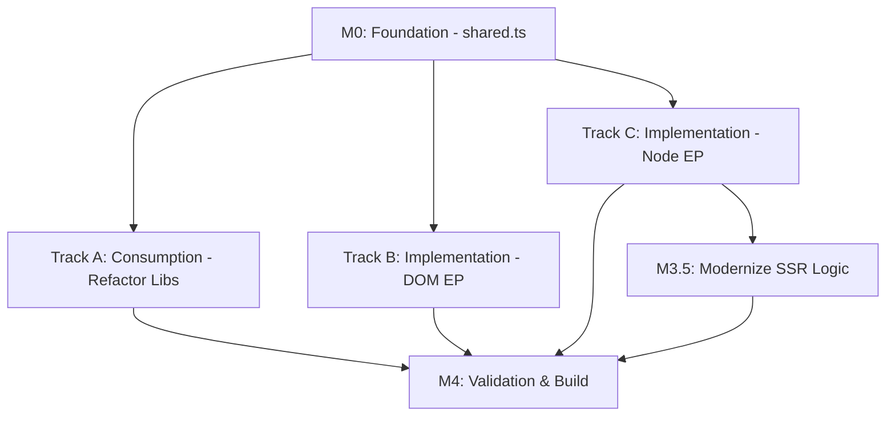

# Parallel Walkthrough: Implementing Dual Entry-Point in `@pounce/core`

To accelerate implementation, this walkthrough is structured into **Parallel Tracks**. Once the Foundation (Milestone 0) is laid, multiple agents can work concurrently on the Consumption and Implementation paths.

## Dependency Graph

---

## Milestone 0: The Foundation (BLOCKING)
*Goal: Define the contract that all other tracks will depend on.*
**Agent Assigned: 1**

1. [ ] **Define `src/shared.ts`**:
   - Export `Platform` interface.
   - Export mutable `platform` object with `implementationDependent` stubs.
   - **Note**: Do not import anything from `src/lib` here.

---

## Parallel Track A: Consumption (The "Top-Down" Path)
*Goal: Refactor existing logic to use the new platform contract.*
**Agent Assigned: 2 (can be split)**

1. [ ] **Refactor `src/lib/renderer.ts`**: Replace global `document`/`Node` with `platform` equivalents.
2. [ ] **Refactor `src/lib/index.ts`**: Update `bindApp` and remove global side-effects.
3. [ ] **Refactor `src/lib/utils.ts`**: Ensure type-safety for platform-dependent utilities.
4. [ ] **Audit remaining `./lib`**: Ensure zero direct references to browser globals.

---

## Parallel Track B: DOM Implementation (The "Browser" Path)
*Goal: Create the native browser booster.*
**Agent Assigned: 3**

1. [ ] **Implement `src/dom.ts`**:
   - Create direct bindings between `platform` and native `window`/`document`.
   - Re-export `src/index.ts`.
2. [ ] **Vitest Configuration**: Set up a test suite that specifically targets the DOM entry point using `@vitest/environment-jsdom`.

---

## Parallel Track C: Node Implementation (The "Isolation" Path)
*Goal: Create the thread-safe Node/SSR engine.*
**Agent Assigned: 4**

1. [ ] **Implement `src/node/bootstrap.ts`**:
   - Initialize `AsyncLocalStorage`.
   - Implement the `platform` proxy/getters that pull from the store.
2. [ ] **Implement `src/node.ts`**:
   - Run bootstrap.
   - Re-export `src/index.ts`.
3. [ ] **Milestone 3.5: Modernize SSR**:
   - Update `server.ts` to use the new `AsyncLocalStorage` backed `withSSR`.

---

## Milestone 4: Final Integration & Build
*Goal: Stitch it all together.*
**Agent Assigned: Lead Agent**

1. [ ] **Update `package.json`**: Configure `exports` (node vs default).
2. [ ] **Update `tsconfig.json`**: Ensure paths and types align for all EPs.
3. [ ] **Parallel Test Run**: Execute unit tests against both paths to ensure parity.
